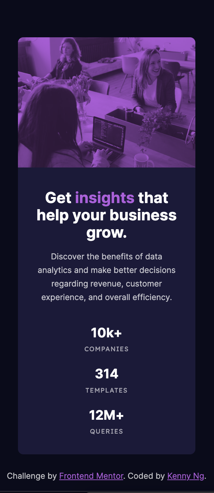

# Frontend Mentor - Stats preview card component solution

This is a solution to the [Stats preview card component challenge on Frontend Mentor](https://www.frontendmentor.io/challenges/stats-preview-card-component-8JqbgoU62). Frontend Mentor challenges help you improve your coding skills by building realistic projects.

## Table of contents

- [Overview](#overview)
  - [The challenge](#the-challenge)
  - [Screenshot](#screenshot)
  - [Links](#links)
- [My process](#my-process)
  - [Built with](#built-with)
  - [What I learned](#what-i-learned)
  - [Useful resources](#useful-resources)
- [Author](#author)

## Overview

### The challenge

Users should be able to:

- View the optimal layout depending on their device's screen size

### Screenshot
<p>Desktop version</p>

<p>Mobile version</p>


### Links

- Solution URL: [Add solution URL here](https://your-solution-url.com)
- Live Site URL: [Add live site URL here](https://your-live-site-url.com)

## My process

### Built with

- Semantic HTML5 markup
- CSS custom properties
- Flexbox
- CSS Grid
- Mobile-first workflow

### What I learned

- CUBE methodology

- A way to make colour overlay image. Instead of creating a transparent coloured 'div' overlay an image, we can set the background colour to <b>parent</b> and set mix-blend-mode property to <b>child</b>.
```html
<picture class="bg-primary-400">
```
```css
.card > picture > img {
  mix-blend-mode: multiply;
  opacity: 0.75;
}
```

- Useful unit 'ch' to limit a paragraphs with how many characters per line.
```css
.card-content > p {
  margin-top: 1.5rem;
}
```

### Useful resources

- [CUBE CSS blog by Andy bell](https://andy-bell.co.uk/cube-css/)
- [The ch unit is the most underappreciated CSS unit by Kevin Powell](https://www.youtube.com/watch?v=dgbFtMBOMlA&ab_channel=KevinPowell)

## Author

- Website - [Kenny Ng](https://www.github.com/kennylun123)
- Frontend Mentor - [@kennylun123](https://www.frontendmentor.io/profile/kennylun123)
